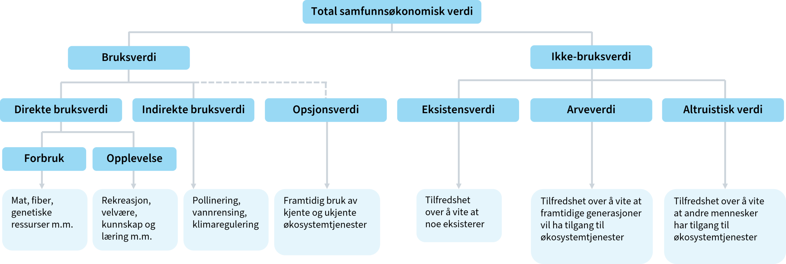
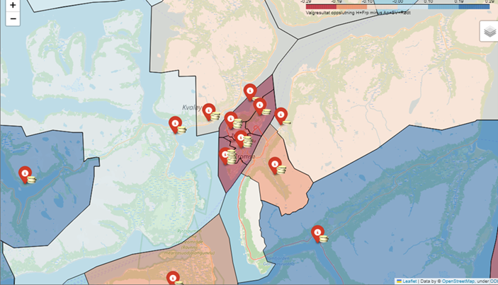

   

# Avdekke preferanser:

### Oversikt over ulike verdsettingsmetoder for prissetting:

| Tilnærming            | Type verdi               | Vanligste verdsettingsmetoder                                                                                              |
|-----------------------|--------------------------|----------------------------------------------------------------------------------------------------------------------------|
| Faktisk marked        | Markedsbasert            | Bruksverdi: Markedspriser, kostnader ved avbøtende tiltak, kostnader ved å erstatte tapte miljøgoder                       |
| Parallelle markeder   | Avslørte preferanser     | Bruksverdi: Hedonisk prising (eiendomspriser, lønninger), reisekostnadsmetoden                                              |
| Hypotetiske markeder  | Uttrykte preferanser     | Bruksverdi og ikke-bruksverdi: Betinget verdsetting, valgeksperimenter                                                      |

## Fordeler og ulemper

### Markedsbasert

* Den foretrukkene metoden
* Markedspriser er ofte ikke tilgjengelig

### Metoder basert på avslørte preferanser 

* Forholdsvis pålitelig 
* Begrenset bruksområde
* Mest egnet til bruksverdi
* Bør suppleres med uttryket preferanser

### Metode for uttrykte preferanser

* Kan anvendes på alle typer goder
* Folk vil ofte ikke oppgi korrekte svar på hypotetiske valg

## Bruk av fageksperter for å verdsette virkninger

* Bedre til å vurdere sannsynligheter
* Samme metoder for å avdekke preferanser kan brukes på eksperter
* Ekspertvurdering vil ikke alltid samsvare med publikums egne preferanser
* Ekspertvurderinger kan å også brukes til å designe scenarier for betinget verdsetting og valgeksperimenter

## Miljøvirkninger

* Miljøverdi kan være vanskelig å verdsette, spesielt ikke-bruksverdi
* Ofte er urimelig å forutsette at befolkningen (respondenten) har erfaring med å ta valg som påvirker tilgangen til eller kvaliteten på disse godene.
* Verdioverføringer fra tidligere gjennomførte studier brukes ofte, men forutsetter at de underliggende verdsettingsstudiene er av høy kvalitet

## Kostnadsbasert verdsettelse

* Beregne hva det vil koste å unngå eller avbøte tapet av et miljøgode
* F.eks. støyisolering

# Usikkerhetsanalyse

## Vurdering av usikkerhet kan grovt sett bestå av disse fire stegene:

* kartlegg usikkerhetsfaktorene
* klassifiser usikkerhetsfaktorene
* gjennomfør usikkerhetsanalyse
* vurder risikoreduserende tiltak

## Husk at usikkerhet allerede er tatt høyde for til en viss grad av usikkerhet

* Tiltak med høy risiko eller umoden teknologi kan ha blitt forkastet når relevante tiltak ble valg ut i arbeidsfase 2 
* Forventningsverdien tar hensyn til ulike sannsynligheter for ulike utfall
* Kalkulasjonsrenten tar hensyn til risiko

## Ulike typer av usikkerhet

* **Tiltaks- og prosjektinterne forhold**: Usikkerhet knyttet til gjennomføringen av prosjektet og til det man har betydelig kontroll over. Usikkerhet knyttet til selve prosjektet og organisasjonens gjennomføringsevne er sentralt. I et investeringsprosjekt kan det også være viktig å vurdere blant annet usikkerhet knyttet til teknikk, produksjonsplaner og kvaliteten på planmaterialet og prosjekteringen.
* **Hendelsesusikkerhet**: Dette er en gjennomgang av de hendelser som kan inntreffe, og som vil kunne påvirke virkningene til tiltaket eller prosjektet, inkludert den anslåtte sannsynligheten for at hendelsene inntreffer. Eksempler kan være at det opprettes et privat konkurrerende tilbud til en offentlig tjeneste, eller at et IT-system ikke lenger vil fungere.
* **Generell usikkerhet**: Dette er faktorer som er tiltaks- og prosjektinterne, og som kan påvirkes, men også alle grader av eksternt gitt usikkerhet og usikkerhet som ikke kan påvirkes.

## Ulike typer usikkerhetsanalyse

* følsomhetsanalyser

|                             | Pessimistisk verdi | Forventet verdi | Optimistisk verdi |
|-----------------------------|--------------------|-----------------|-------------------|
| Forventet investeringskostnad (mill. kr) | 300              | 125             | 50                |
| Netto nåverdi (mill. kr)    | -47               | 128             | 203               |

* scenarioanalyser
    * Utvidelse av følsomhetsanalyse
  
    
* simuleringer
    * Monte Carlo
	
## Risikoreduserende tiltak
* forebygge avvik fra forventningsverdien
* planlegge for å begrense konsekvensene av avvik eller uheldige hendelser 

## Realopsjoner
* Det er betydelige (irreversible) kostnader forbundet med å komme tilbake til utgangspunktet
* Det er sannsynlig at man senere får ny informasjon som gir god støtte i beslutningsprosessen.
* Det er handlingsrom når man på et senere tidspunkt skal ta en ny beslutning om tiltak. 

### Forskjellige typer realopsjoner

* Utsatt beslutning: 
* Trinnvis utbygging: 
* Innbygd fleksibilitet: 
* Avslutning av tiltak: 

# Fordelingsvirkninger

* Skal ikke foretas fordelingsvekting i selve nåverdianalysen
	* Tas med i tilleggsanalyse
* Der det er relevant skal det gis tilleggsinformasjon om fordelingsvirkninger
* Økt sysselsetting i én region på bekostning av færre sysselsatte i en annen, er en fordelingsvirkning - ikke en ringvirkning
* Nyttig for beslutningstaker
* Fordeling kan av og til være hovedformålet med tiltaket
	* En kan da for eksempel sammenligne NV til ulike alternative måter å oppnå en bestemt fordeling
* Vurder om det finnes kompenserende alternativer

## Hvilke fordelingsvirkninger er relevante?

* geografiske regioner i Norge
* offentlige virksomheter
* privat næringsliv
* privatpersoner
* brukere og ikke-brukere av et offentlig tiltak
* sosioøkonomiske grupper, inndelt etter for eksempel 
	* inntektsnivå
	* sivil status
	* alder
	* barnefamilier
	* funksjonsevne
	* sykdomsgruppe
* yrkesgrupper
* forskjellige generasjoner
* kjønn

## Eksempel på fordelingsanalyse:
| Kvintil                    | Beregnet overskudd ved tiltaket |
|----------------------------|---------------------------------|
| 1. kvintil                 | –45 000 000                     |
| 2. kvintil                 | –60 000 000                     |
| 3. kvintil                 | 20 000 000                      |
| 4. kvintil                 | 150 000 000                     |
| 5. kvintil                 | 185 000 000                     |
| **Summert over alle grupper**  | **250 000 000**             |

## Gegografisk fordeling
Bruk det dere lærte i sok-1005:

[Lenke til notebooks](https://espensirnes.github.io/notebooks/html/11%20-%20interaktive%20websider.html)

# Oppgave:

Se på rapportene

* Finn ett eksempel på verdivurderinger der det ikke finnes noe faktisk marked, eller foreslå hvor forfatterne kunne ha gjort verdivurderinger
* Hvilken metode har forfatterne brukt på å finne verdien?